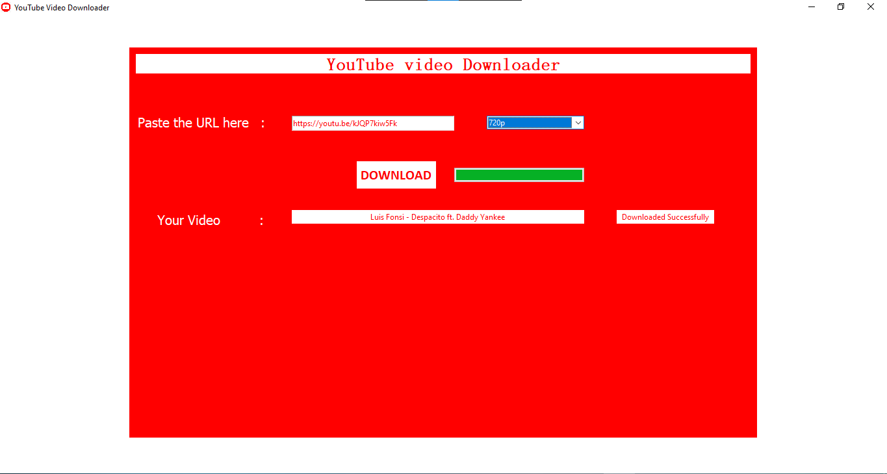

# YOUTUBE_Video_DOWNLOADER
 
 A Simple YouTube Video Downloader using Python.
 
 This Code done by using a python GUI called tkinter. so that to run this code you need to install the tkinter python.
 
 You can paste the Youtube URL on the textfield and choose your required resolution and Click DOWNLOAD.
 
 
